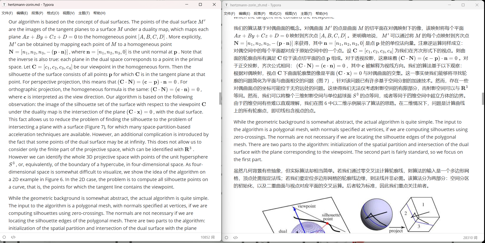

# Markdown Bilingual Translate

[English README](./README.md)

这是一个极简版 Codex Skill。

公开可运行的内容只有一个脚本：

- `scripts/translate_md.py`

它会把单个 Markdown 文件翻译成双语 Markdown：

- 原文块
- 紧跟其后的简体中文译文块

公式和 fenced code block 会原样保留。



## 运行要求

- Python 3.8+
- `ARK_API_KEY`

不需要额外安装第三方包。

脚本会按下面顺序读取 `ARK_API_KEY`：

1. 当前进程环境变量
2. `%CODEX_HOME%\.env`
3. `~/.codex/.env`

示例：

```env
ARK_API_KEY=your_api_key_here
```

## 用法

```powershell
python .\scripts\translate_md.py --input-path papers\example.md
```

可选：指定输出路径

```powershell
python .\scripts\translate_md.py `
  --input-path papers\example.md `
  --output-path papers\example_zh.md
```

默认会生成：

- `papers/example_zh.md`
- `papers/example_zh.md.metrics.json`

翻译过程中还可能生成临时进度文件，成功后会自动删除。
